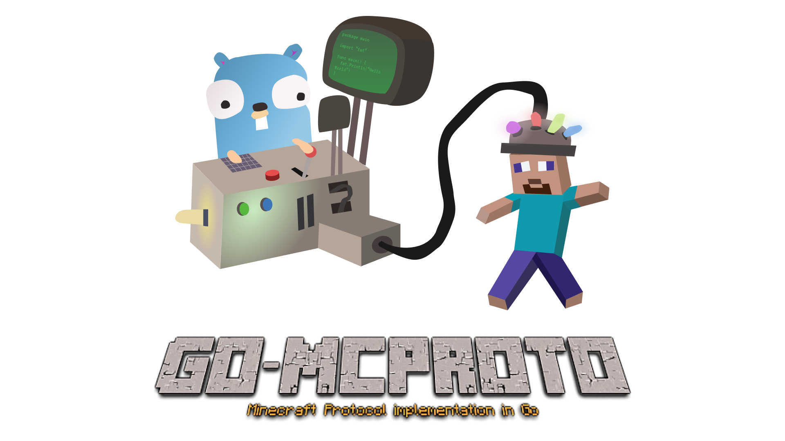

<div align="center">

  <a href="https://pkg.go.dev/github.com/BRA1L0R/go-mcproto"></a>
  <a href="http://github.com/BRA1L0R/go-mcproto"></a>
  <a href="https://github.com/BRA1L0R/go-mcproto/actions"></a>
</div>

<div align="right">
<h6> illustration by <a href="https://github.com/talentlessguy" >@talentlessguy</a></h6>
</div>

## Install

Go 1.16.x is required to use this library

```sh
go get github.com/BRA1L0R/go-mcproto
```

## Opening a connection

```go
client := mcproto.Client{Host: "IP or Hostname", Port: 25565, Name: "GoBot", ProtocolVersion: 754}
```

Before opening a connection to a server, you'll have to specify some vital information such as the host, the port,
the name of your bot (which will login in offline mode) and the protocol version, which will have to match the server one,
unless the server uses some kind of backward compatibility plugin such as ViaVersion.

In this case, 754 is the protocol version for Minecraft 1.16.5 but you can find all the versions [here](https://wiki.vg/Protocol_version_numbers)

Once you define client, you can either use the already implemented handshake method (`client.Initialize`) or you can manually open the connection using `client.Connect`

`client.Initialize` only supports offline mode (unauthenticated SP) at the moment but I will soon implement online mode as well.

## Defining a packet

Not all packets are implemented in the library there are only the ones that will get you past the login state.

Fortunately, defining a packet with go-mcproto is as easy as declaring a struct. Here's a quick example

```go
type ChatMessage struct {
  packets.MinecraftPacket

  JsonData string `mc:"string"`
  Position byte   `mc:"inherit"`
  Sender   []byte `mc:"bytes" len:"16"` // UUID is 128bit, hence the 16 byte len
}
```

packets.MinecraftPackets will add the rest of the fields which are needed for a packet to be conformant to the standard format, compressed or not

ChatMessage will also inherit from packets.MinecraftPackets the methods for serialization of the fields into Data and the final serialization which returns the byte slice that can be sent over a connection using `client.WritePacket`

### Arrays

Sometimes you might encounter a packet that sends before an array the length of it. Fortunately, you can still deserialize the packet with no extra steps thanks to the len tag:

```go
type Biome struct {
  BiomeID int32 `mc:"varint"`
}

type ChunkData struct {
  packets.MinecraftPacket

  BiomesLength int32   `mc:"varint"`
  Biomes       []Biome `mc:"array" len:"BiomesLength"`
}
```

The Biome struct can contain as many fields as you like, as the minecraft protocol has a lot of cases where there are multi-fielded arrays

### Field Dependency

In some cases, a field is present only if the previous one is true (in the case of a boolean). You can still manage to do this with only struct tags by using the `depends_on` tag:

```go
type PlayerInfo struct {
  packets.MinecraftPacket

  HasDisplayName bool   `mc:"inherit"`
  DisplayName    string `mc:"string" depends_on:"HasDisplayName"`
}
```

### All the available tags

This library already integrates all the possible types to define all possible data types, including NBTs.

Here's a list of all the available tags:

- `mc:"inherit"`: this tag covers all integers, complexes, floats, and the `byte` type. It inherits the length from the type defined in the struct. See the examples above. Please note: the Minecraft protocol is effectively big-endian, except varints, which are defined using another tag.
- `mc:"varint"` and `mc:"varlong"`: Used to encode varints and varlongs respectively. Requires a int32 and int64 (respectively) as the field types
- `mc:"string"`: requires a string field type in the struct, it encodes its length using a varint end then the string is encoded using the UTF-8.
- `mc:"bytes" len:"X"`: Reads X bytes from the buffer and puts it in a byte slice, which must be the type of the struct field this tag is assigned to. _X is only required for deserialization in this case_
- `mc:"ignore" len:"X"`: Ignores X bytes from the buffer. This means that it discards X bytes from the data buffer in case of deserialization or writes X null bytes in the data buffer in case of serialization
- `mc:"nbt"`: Encodes or decodes an nbt struct. For more information check https://github.com/Tnze/go-mc/tree/master/nbt
- `mc:"array" len:"X"`: Can be used to array every previous tags. Check [this section](#arrays)

## Sending a packet

Once you have defined a packet you want to send, you will have to call `client.WritePacket()` to serialize the data and send it over a connection.

```go
packet := new(MyPacket)
packet.PacketID = 0x00
// you can look up the packet ids on wiki.vg
// all the other fields

client.WritePacket(packet)
```

### Sending a raw packet

If you already put data into the Data buffer by yourself, without using the included serialized, then you can send the packet using the `WriteRawPacket` method.

## Receiving a packet

Receiving a packet is done by calling `client.ReceivePacket`. The server will receive the packet length and wait for the server until all bytes are fulfilled. If it encounters an error it will return it, but it will keep receiving packets as all the packet length is already consumed from the connection.

`client.ReceivePacket` will return a MinecraftPacket, which can be deserialized using the DeserializeData method. It'a called by passing a pointer to a struct containing mc struct tags, as explained [here](#defining-a-packet)

```go
packet, err := client.ReceivePacket()
if err != nil {
  // an error has been encountered during the reception of the packet
  panic(err)
}

keepalive := new(models.KeepAlivePacket)
err := packet.DeserializeData(keepalive)
if err != nil {
  panic(err)
}

fmt.Println(keepalive.KeepAliveID) // 123456
```

### Variable packet content

There are multiple cases in the Minecraft protocol where the packet content is variable depending on certain values inside the struct. **This is no problem for the library**, as you can easily receive a part of the packet (by defining only the fixed fields in the struct) and then, later on, continue the deserialization by calling `DeserializeData` on a different struct.

Here's a practical demonstration:

```go
type FixedContent struct {
  packets.MinecraftPacket

  PacketType int32 `mc:"varint"`
}

type SomeOtherContent struct {
  packets.MinecraftPacket

  Data string `mc:"string"`
}

packet, _ := client.ReceivePacket()
// from now on I'm gonna avoid doing error handling in the examples for practical reasons
// but you MUST do it.

fixedPacket := new(FixedContent)
packet.DeserializeData(fixedPacket)

if fixedPacket.PacketType == 0x05 {
  someOtherContent := new(SomeOtherContent)
  packet.DeserializeData(someOtherContent)
} else {
  panic("Unknown packet type!")
}
```

## Example ✨

This example initializes the connection between the client and a server, thus switching to the Play state, and listens for keepalive packets to which it responds

```go
package main

import (
	"github.com/BRA1L0R/go-mcproto"
	"github.com/BRA1L0R/go-mcproto/packets/models"
)

func main() {
  client := mcproto.Client{
    Host: "my.minecraftserver.com",
    Port: 25565,
    ProtocolVersion: 754, // 1.16.5
    Name: "ExampleBot",
  }

  client.Initialize()

  for {
    packet, err := client.ReceivePacket()
    if err != nil {
      panic(err)
    }

    if packet.PacketID == 0x1F { // clientbound keepalive packetid
      receivedKeepalive := new(models.KeepAlivePacket)
      err := packet.DeserializeData(receivedKeepalive)
      if err != nil {
        panic(err)
      }

      serverBoundKeepalive := new(models.KeepAlivePacket)
      serverBoundKeepalive.KeepAliveID = receivedKeepalive.KeepAliveID
      serverBoundKeepalive.PacketID = 0x10 // serverbound keepaliveid

      err = client.WritePacket(serverBoundKeepalive)
    }
  }
}
```
